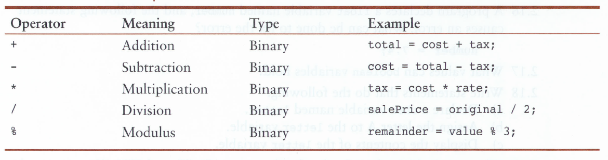

# Unit 1 - Java Fundamentals

## [L5 Sandbox][sandbox]


## Arithmetic Operators

An [**operator**](https://www.tutorialspoint.com/java/java_basic_operators.htm), in Java, executes a task on variables and values. Operators can be grouped into the following:  

* Arithmetic
* Assignment
* Relational
* Logical
* Conditional

As you progress through this course, you will learn about the operators in each group. Like variables, operators are key to programming. 

[**Arithmetic Operators**](https://www.tutorialspoint.com/java/java_basic_operators.htm) are just your basic math operations. 



These operators work precisely how they do in Math or Algebra class. The program below illustrates the use of a few of these operators. Try this in the [**SANDBOX**][sandbox]

```java
public class L5{
    public static void main(String[] args){
        
        double basePay = 7.25;
        double hoursWeek1 = 16.5;
        double hoursWeek2 = 23.75;

        double totalHours = hoursWeek1 + hoursWeek2;
        double wages = basePay * totalHours;

        System.out.println("Your bi-weekly paycheck is: $" + wages);
    }
}
```
>**PROGRAM OUTPUT**
>
>`Your bi-weekly paycheck is: $291.8125`

First, notice the program declares variables with literal values first. You will find that this is a common practice in programming. As your programs use more and more variables, it makes for a better organized and readable code if they are all declared and initially assigned at the top. 

Next, you'll notice the program declares a `totalHours` variable and then assigns to it the sum of `hoursWeek1` and `hoursWeek2`. [**ALL DATA, COMPUTED OR LITERAL, MUST BE ASSIGNED TO A VARIABLE**](). You can't have data just floating around in cyberspace. There would be no way to retrieve that data. It has to be stored in a variable, so it can be accessed and used.

The next line of the program, again, calculates some data, `basePay * totalHours` and then assigns that to the variable `wages`. Notice the program is using variables to calculate and not literal values. Eventually, those literal values will be supplied by the user via input, so its good practice to get in the habit of using variables. 

Lastly, wages is display to the user with information about what the data is. It is good practice to always include some text in your output that explains what the data is. [**LET THE COMPUTER DO THE MATH**]().

Let's look at what's wrong with this program. Use comments and edit the notes to add your observations.

```java
public class L5{
    public static void main(String[] args){
        
        double basePay = 7.25;
        double hoursWeek1 = 16.5;
        double hoursWeek2 = 23.75;

        double totalHours = 40.25;      //your notes here
        7.25 * 40.25;                   //your notes here
        
        System.out.println("Your bi-weekly paycheck is: $" + 291.8125);     //your notes here
    }
}
```

### Division Is Tricky

Pop over into the [SANDBOX][sandbox] and try these two programs.
```java
public class L5{
    public static void main(String[] args){
        
        int fraction = 1/2;
        System.out.println(fraction);
                
    }
}
```

What's the output? `your answer here`

```java
public class L5{
    public static void main(String[] args){
        
        double fraction = 1/2;        
        System.out.println(fraction); 

    }
}
```

What's the output? `your answer here`


The rule for division is this: 

* int / int = int , removes any trailing decimals

* int / double = double , keeps all decimals

* double / int = double, keeps all decimals

* double / double = double, keeps all decimals.


### Order of Precedence

Recall the flow of execution from earlier, which defines the order of processes statements from top to bottom. The [**Order of Precedence**](http://www.cs.bilkent.edu.tr/~guvenir/courses/CS101/op_precedence.html) specifies which operations to do in which order when reading the code from left to right. Remember, Java READS first, then EXECUTES. It will read a statement, arrange the operators in order of precedence, then execute them in order when it reads the `;`. 

This is very similar to the **Order of Operations** in Math and Algebra. You can use parenthesis to control the order of precedence. Parentheses are evaluated first, but keep in mind that the order of precedence is re-evaluated inside the parenthesis. 

WITHOUT using the SANDBOX, evaluate the following statements. 
```
5 + 2 * 4               your answer here
12 / 2 - 4              your answer here
4 + 17 % 2 -1           your answer here
4 + 5 * 2 / 2 + 1       your answer here
4 * (6 + 3 * 2) + 7     your answer here
```

There are a few differences between Math/Algebra and programming. In Math/Algebra, when multiplying a number and parentheses (as in the last example) you might write 4(6+3). However, in programming the `*` operator MUST be included between the number and parentheses. Further, `X` does not mean multiplication, you must use `*`.

TO THE [**SANDBOX**][sandbox] !!!


[sandbox]: ../L5.java